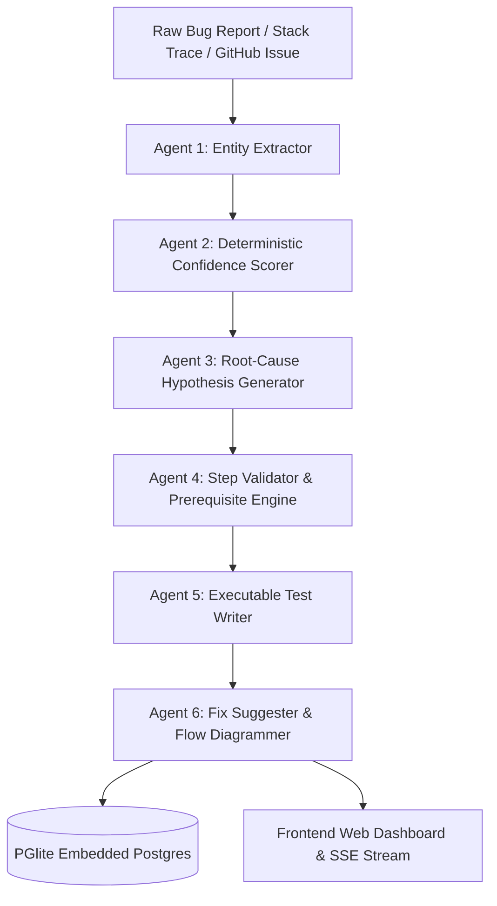

# 🐞 AI-Powered Multi-Agent Bug Reproduction Engine

An autonomous, end-to-end multi-agent AI system designed to convert raw, unstructured bug reports, stack traces, and GitHub issues into structured technical entities, ranked root-cause hypotheses, step-by-step reproduction flows, ready-to-run Jest/RTL unit tests, and interactive Mermaid.js architecture flowcharts.

---

## 📋 Table of Contents
1. [Overview & Vision](#-overview--vision)
2. [Multi-Agent Pipeline Architecture](#-multi-agent-pipeline-architecture)
3. [Key Features & Application Pages](#-key-features--application-pages)
4. [Technology Stack](#-technology-stack)
5. [Prerequisites](#-prerequisites)
6. [Step-by-Step Installation & Setup](#-step-by-step-installation--setup)
7. [Environment Configuration](#-environment-configuration)
8. [Running the Application](#-running-the-application)
9. [Database & Data Management](#-database--data-management)
10. [REST API Reference](#-rest-api-reference)
11. [Verification & Diagnostic Commands](#-verification--diagnostic-commands)
12. [Troubleshooting & FAQ](#-troubleshooting--faq)
13. [License](#-license)

---

## 🎯 Overview & Vision

Software debugging is often slowed down by vague user reports, missing environment context, unverified stack traces, and the time required to write deterministic reproduction tests. 

The **AI-Powered Bug Reproduction Engine** solves this by employing a multi-agent orchestration pipeline. Each agent is specialized for a distinct phase of the debugging lifecycle — from entity parsing to deterministic confidence scoring, root-cause hypothesis ranking, automated test code generation, and fix recommendations.

---

## 🧬 Multi-Agent Pipeline Architecture



### Specialized Agents Overview:
1. **Agent 1 — Entity Extraction Agent:** Parses raw text into structured JSON schemas (affected components, triggering actions, expected vs actual behavior, error codes, and environment details).
2. **Agent 2 — Confidence Scorer:** Calculates an objective 0–100 confidence score based on verifiable input signals (stack trace presence, environment info, reproduction step clarity).
3. **Agent 3 — Hypothesis Generator:** Formulates, ranks, and retains/eliminates root-cause hypotheses based on evidence mechanics.
4. **Agent 4 — Step Validator:** Generates step-by-step reproduction instructions with prerequisite checks.
5. **Agent 5 — Executable Test Writer:** Synthesizes ready-to-execute Jest, React Testing Library, or Vitest TypeScript unit & integration test files.
6. **Agent 6 — Fix Suggester & Diagrammer:** Renders interactive Mermaid.js failure diagrams and recommends actionable code-level fixes with confidence rankings.

---

## 💻 Key Features & Application Pages

- 🏠 **Home Page (`/`):**
  Submit raw text bug reports or GitHub issue URLs. Features live Server-Sent Events (SSE) streaming as each AI agent executes in real time.

- 📜 **Analyses History (`/history`):**
  Interactive, filterable table displaying all past bug analyses with confidence badges, input types, dates, and severity tags.

- 📊 **Analytics Dashboard (`/dashboard`):**
  Visual charts, severity distribution metrics, confidence score trends, and system throughput summary.

- 🔬 **Analysis Detail Deep-Dive (`/detail/:id`):**
  Multi-tab interface providing deep technical breakdown:
  - **Entities:** Extracted component metadata and environment specs.
  - **Hypotheses:** Ranked root-cause theories with mechanisms.
  - **Reproduction Steps:** Step-by-step instructions and prerequisites.
  - **Test Code:** Syntax-highlighted Jest/RTL unit tests with one-click copy.
  - **Flow Chart:** Interactive Mermaid.js visualization of the bug execution path.
  - **Fix Suggestions:** Prioritized code fixes with target file locations.

- 🧪 **NL-to-Test Generator (`/nl2test`):**
  Converts plain English bug descriptions directly into structured assertions.

- ⚡ **Flaky Test Detector (`/flaky-detector`):**
  Analyzes intermittent test behavior and computes flakiness probability scores.

- 🌐 **Environment Matrix Diff (`/env-diff`):**
  Compares OS, browser, and runtime matrix mismatches between working and failing setups.

- 📂 **Project Registry (`/projects`):**
  Organize bug reports by software project or repository.

- 📄 **Export Suite (`/export`):**
  Export diagnostic reports to Markdown or PDF formats.

---

## 🛠️ Technology Stack

| Layer | Technologies Used |
|-------|-------------------|
| **Frontend UI** | React 18, Vite, Tailwind CSS, Lucide Icons, Shadcn UI, Recharts, Mermaid.js |
| **Backend API** | Node.js, Express, Fastify, Zod Schema Validation, SSE Streaming |
| **Database** | `@electric-sql/pglite` (WASM Embedded PostgreSQL), Drizzle ORM |
| **AI Infrastructure** | Groq AI (`llama-3.3-70b-versatile`), OpenAI SDK, OpenRouter API |
| **Package Manager** | PNPM Workspace |

---

## 📋 Prerequisites

Before setting up the project, ensure you have the following installed on your machine:

1. **Node.js**: Version `v20.0.0` or higher (Download from [nodejs.org](https://nodejs.org/))
2. **PNPM Package Manager**: Version `v9.0.0` or higher:
   ```bash
   npm install -g pnpm
   ```
3. **Git**: Version `2.x` or higher

---

## ⚙️ Step-by-Step Installation & Setup

### Step 1: Clone the Repository
```bash
git clone https://github.com/your-username/AI-BugReproducer.git
cd AI-BugReproducer
```

### Step 2: Install Dependencies
Install all workspace dependencies using PNPM:
```bash
pnpm install
```

### Step 3: Configure Environment Variables
Create a `.env` file in the root directory by copying the `.env.example` template:

**On Linux/macOS:**
```bash
cp .env.example .env
```

**On Windows (PowerShell):**
```powershell
Copy-Item .env.example .env
```

---

## 🔑 Environment Configuration

Open `.env` in your code editor and configure your Groq API Key:

```env
# Server Port Configuration
PORT=8080
FRONTEND_PORT=5000

# LLM Provider Configuration
LLM_PROVIDER=groq
GROQ_API_KEY=your_groq_api_key_here
GROQ_MODEL=llama-3.3-70b-versatile

# Database Path (Default embedded PGlite location)
DATABASE_URL=file:.data/pgdata
```

> **Note:** Get your free Groq API key from [console.groq.com](https://console.groq.com/).

---

## 🏃 Running the Application

To run the full application locally, you will start the **Backend API Server** and the **Frontend Web Client**.

### 1. Build Backend Bundle (Required First Time)
```bash
pnpm --filter @workspace/api-server run build
```

### 2. Start Backend API Server (Port 8080)
```powershell
$env:PORT="8080"; node ./artifacts/api-server/dist/index.mjs
```

### 3. Start Frontend Web Client (Port 5000)
Open a second terminal window and run:
```powershell
$env:PORT="5000"; $env:BASE_PATH="/"; $env:API_PROXY_TARGET="http://127.0.0.1:8080"; pnpm --filter @workspace/bug-engine run dev
```

### 4. Access the Application
Open your web browser and navigate to:
👉 **[http://localhost:5000](http://localhost:5000)** (Main UI)  
👉 **[http://localhost:5000/history](http://localhost:5000/history)** (Bug Analyses History)

---

## 🗄️ Database & Data Management

This project uses **PGlite** (`@electric-sql/pglite`), an embedded WASM PostgreSQL database that stores data locally in `.data/pgdata`. **No external PostgreSQL server installation is required!**

### Importing the Benchmark Dataset (`analyses.csv`):
To load all 55 benchmark bug analysis records into your local database:
```bash
pnpm --filter @workspace/scripts exec tsx ./src/import-csv-data.ts
```

### Seeding 25 Baseline Demo Records:
```bash
pnpm --filter @workspace/scripts exec tsx ./src/seed-analyses.ts
```

---

## 📡 REST API Reference

| Method | Endpoint | Description |
|--------|----------|-------------|
| `GET` | `/api/healthz` | System health check |
| `GET` | `/api/analyses` | List all bug analyses |
| `GET` | `/api/analyses/:id` | Fetch specific bug analysis by ID |
| `POST` | `/api/analyses` | Submit new bug report for AI analysis |
| `POST` | `/api/analyses/:id/run` | Trigger real-time SSE AI agent analysis stream |
| `DELETE` | `/api/analyses/:id` | Delete an analysis record |
| `GET` | `/api/analyses/stats/summary` | Get aggregated system metrics |
| `GET` | `/api/analyses/trends` | Fetch 30-day analysis trend points |
| `GET` | `/api/settings/llm` | Read LLM provider configuration |
| `POST` | `/api/settings/llm/test` | Test live Groq AI API key connection |
| `GET` | `/api/projects` | List all registered projects |

---

## 🧪 Verification & Diagnostic Commands

Run the automated point-to-point verification suite to validate all API endpoints, database persistence, LLM connectivity, and frontend proxies:

```bash
pnpm --filter @workspace/scripts exec tsx ./src/verify-deployment.ts
```

**Expected Verification Output:**
```
=== VERIFICATION SUMMARY RESULTS ===
✅ ALL 11 POINT-TO-POINT VERIFICATION CHECKS PASSED PERFECTLY!
```

---

## ❓ Troubleshooting & FAQ

### 1. `Cannot GET /api/health`
- **Solution:** Use the correct health check endpoint: `GET /api/healthz`.

### 2. Invalid Time Value Error on `/history`
- **Solution:** The app uses `formatDateSafe` helper to prevent date formatting crashes on missing ISO timestamps.

### 3. API Key Not Working / Connection Timeout
- **Solution:** Verify `GROQ_API_KEY` in `.env` and test connection via `POST /api/settings/llm/test` or the Settings page UI.

### 4. Port 5000 or 8080 Already in Use
- **Solution:** Stop any process occupying the port or change `PORT` in `.env`.

---

## 📄 License

Distributed under the MIT License. See `LICENSE` for more details.
